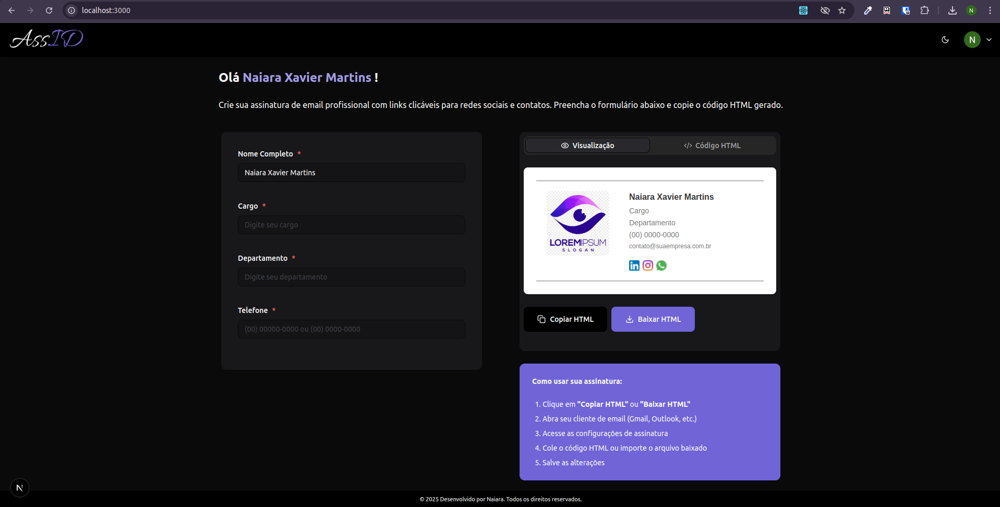

# 🪪 Assine ID

**Assine ID** é uma aplicação web desenvolvida com **Next.js** que permite gerar assinaturas de e-mail corporativas personalizadas de forma rápida, responsiva e profissional.

Ideal para empresas que desejam padronizar a identidade visual das assinaturas de seus colaboradores, o sistema oferece uma interface moderna e intuitiva, com suporte a temas, pré-visualização em tempo real e integração com provedores de autenticação.

---

## ✨ Funcionalidades

- 🔐 Autenticação com **NextAuth (OAuth e credenciais)**
- 🎨 Personalização de assinatura com nome, cargo, contato e departamento
- 🌃 Suporte a tema claro e escuro
- 📄 Pré-visualização em tempo real da assinatura
- 🖨️ Exportação simples para uso em clientes de e-mail
- 📱 Interface responsiva para dispositivos móveis

---

## 💻 Tecnologias Utilizadas

| Categoria        | Tecnologias                                                                                                      |
| ---------------- | ---------------------------------------------------------------------------------------------------------------- |
| **Framework**    | [Next.js 15](https://nextjs.org/), [React 19](https://react.dev/), [TypeScript](https://www.typescriptlang.org/) |
| **Estilo**       | [Tailwind CSS 4](https://tailwindcss.com/)                                                                       |
| **UI/UX**        | [Radix UI](https://www.radix-ui.com/), [lucide-react](https://lucide.dev/)                                       |
| **Autenticação** | [NextAuth.js 5 ](https://next-auth.js.org/)                                                                      |
| **Formulários**  | [Formik](https://formik.org/), [Yup](https://github.com/jquense/yup)                                             |
| **Temas**        | [next-themes](https://github.com/pacocoursey/next-themes)                                                        |
| **Lint/Dev**     | ESLint                                                                                                           |

---

## 🖼️ Prints de Tela

### 🧽 Página Inicial



### 🔐 Tela de Login


---

## ⚙️ Como Rodar o Projeto

### 1. Clone o repositório

```bash
git clone git@github.com:naiaraxavier/signature-generator.git
cd signature-generator

# ou
git clone https://github.com/naiaraxavier/signature-generator.git
cd signature-generator

```

### 2. Instale as dependências

```bash
# npm
npm install

# ou yarn
yarn install

# ou pnpm
pnpm install

# ou bun
bun install
```

### 3. Configure as variáveis de ambiente

Crie um arquivo .env.local com as variáveis necessárias:

```bash
NEXTAUTH_SECRET=sua_chave_secreta

# Exemplo com login via GitHub
AUTH_GOOGLE_ID=seu_client_id
AUTH_GOOGLE_SECRET=seu_client_secret
```

### 4. Rode o projeto

```bash
npm run dev
```

## 🤝 Contribuições

Sinta-se à vontade para abrir issues, enviar pull requests ou sugerir melhorias!
